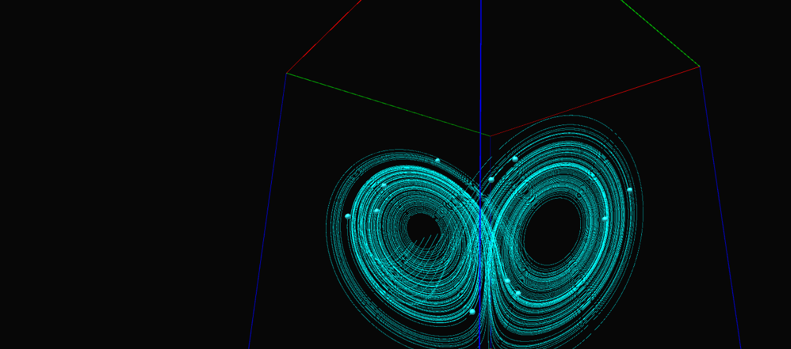

# VOIR: Interactive Visualization Software for HMD
VOIR is an interactive visualization software for HMD-type VR devices. It has been developed upon Unity.
VOIR can visualize three-dimensional scalar and vector data defined in the Cartesian coordinates.
## Getting started
Download or clone this repository, and open the “src” directory in your Unity editor. Modify “XR Plug-in Management” in “Project Setting” for your devices before you execute VOIR. You can also run it on the Unity editor.
### Required Unity version
VOIR has been developed on Unity version 2021.3.4f1. It is expected to work with newer versions of Unity.
### Sample data
Sample data with a configuration file for VOIR is in the “sampledata” directory.

## Usage
See the manual.
- [English manual](./voir_manual.en.md)
- [Japanese manual](./voir_manual.md)
## Others
This software is tested on Oculus Quest2 (on the Oculus Link) and HTC VIVE.
## Licensing
The CS codes in the “src” directory are released under the MIT license.
